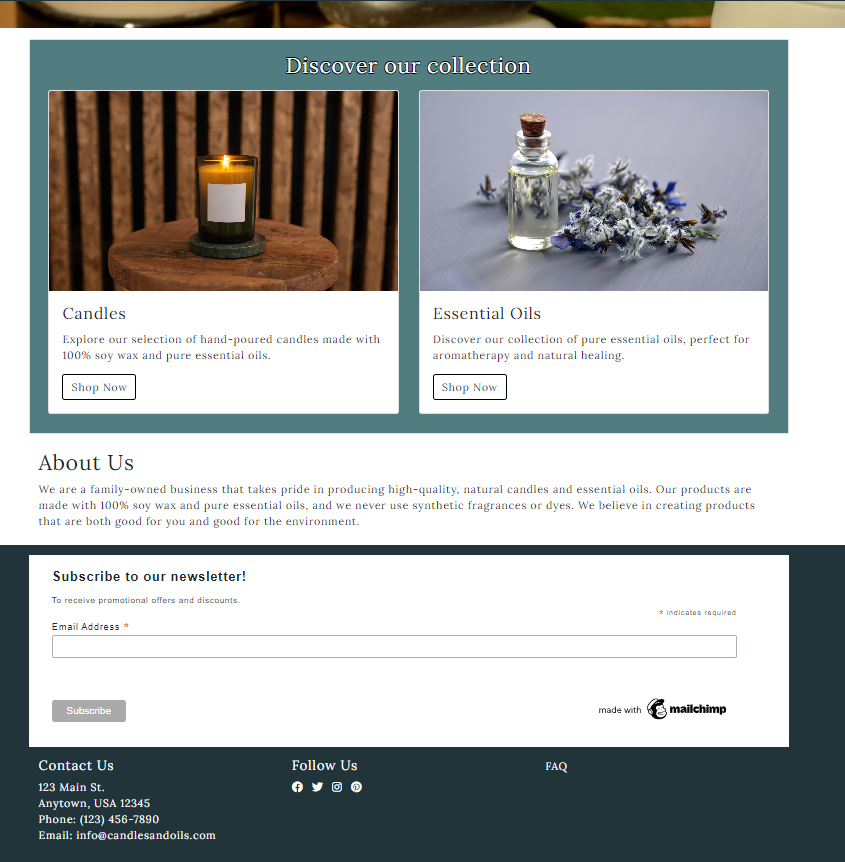
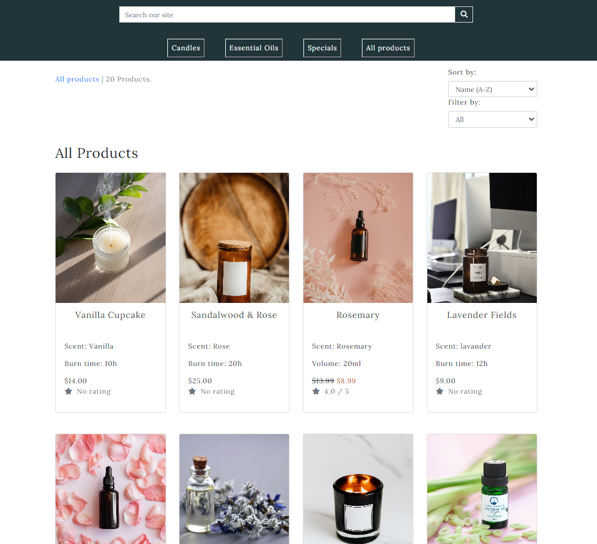
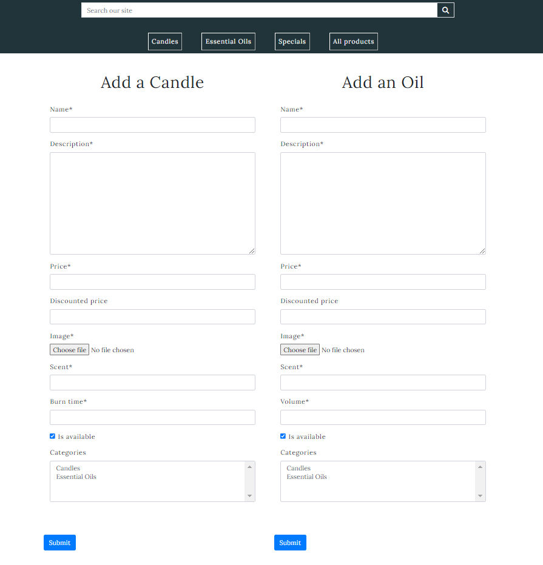

# [Liquid Smoke](https://liquid-smoke.herokuapp.com/)
## Shop for high-quality candles and essential oils at our online store. We offer a wide selection of scents to suit any taste.

 

# Table of contents
* [Design and Build](#design-and-build)
    * [Planning](#the-planning-for-this-project-was-based-on-this-idea)
    * [Model diagrams](#model-diagrams)
    * [Marketing](#marketing-has-been-made-by-a-facebook-page)
    * [Agile](#agile)
* [Features](#features-ux-design)
    * [Navbar](#navbar)
    * [Footer](#footer)
    * [Products](#products)
    * [Candles](#candles)
    * [Essential oils](#essential-oils)
    * [Specials](#specials)
    * [Basket](#basket)
    * [Checkout](#checkout)
    * [Order detail](#order-detail)
    * [Profile](#profile)
    * [Sign in/ Register](#sign-inregister)
    * [Product management](#product-management)
    * [FAQ](#faq)
    * [404](#404-page)
* [Future Features](#features-to-be-implemented)
* [Technology used](#technology-used)
* [Framerowks and libraries](#frameworks-and-libraries-used)
* [Agile methodoloy](#agile-methodology)
    * [User stories](#agile-user-stories)
    * [Tasks](#agile-tasks)
* [Testing](#testing)
    * [Lighthouse](#lighthouse)
    * [Validation](#validation)
    * [Unit testing](#automated-testing-tdd)
    * [Manual testing](#manual-testing)
    * [Responsive](#responsive)
* [Bugs](#bugs)
    * [Django notes](#django-notes)
* [Development and deployment](#development-and-deployment)
    * [Local development](#local-development)
    * [Heroku deployment](#heroku-deployment)
    * [Deployment checklist](#deployment-checklist)
    * [Forking and cloning](#forking-a-repository)
* [Credits](#credits)
* [Acknowledgements](#acknowledgements)
* [Other sources](#other-sources)


# Design and build
### This is a Business to Customer( B2C ) focused application. The intent of this website is to sell candles and essential oils to customers for a single payment at checkout.

## The planning for this project was based on this idea: 

* As a customer: 
    * Open the app to see the products,
    * Add items to the basket,
    * Checkout,
    * Pay and provide delivery details,
    * Get a confirmation email with my order.
    * See past orders
    * Repeat

## Wireframes

 

 


## Model diagrams

## Marketing has been made via a [Facebook page](https://www.facebook.com/profile.php?id=100092371081770)

 

## Agile
### This Project was built following agile methodology and practices
[User stories](#agile-user-stories) further down.

# Features UX design

## Landing page




### When a user first enters the website this is what they see, the landing page containing the navigation panel, footer and a hero image with links to the offers page that is just long enough so users can see there's further content down the page, the collections and the footer

## Navbar


### Navbar on desktop has all the links to other pages on display. The Logo is also a link to the landing page. "My account" is a dropdown menu with links to "My profile/Sign in/Register". The Bag icon is a link to the basket.


### On smaller devices, the products links are turned into a dropdown(hamburger) menu.

## Footer


### In the footer we have the newsletter subscription form, Contact Us address, links to social media, including our facebook page, and FAQ page.

## Products



### On all products page we see candles and oils combined, we can sort by name/price/rating and filter to see only candles/oils


### In the product detail page, we can add to basket (up to 10 products), submit a review and edit/delete a product(Admin only).




### The admin has to option to enter the product management form the account dropdown where they can add more products to the store.

## Candles


### The candles page is only for products in the Candles category, we can see each candle with it's scent, burn time and rating(if any) and can perform sorting.

## Essential Oils


### The Oils page is only for products in the Oils category, we can see each oil with it's scent, volume and rating(if any) and can perform sorting.

## Specials


### In the specials page we have the products on sale ( with discounted price ).

## Basket


### On an empty basket, we cannot see the Secure checkout button.


### The products added to the basket are laid out as a table. The quantity is updated instant on any whole number (up to 10)


### Removing an item from the basket triggers a modal for confirmation

## Checkout


### Once you have items in your basket you can then go to the checkout page, where you add your delivery details, apply coupon if any, and pay.

## Orders


### The order success confirmation is triggered after a successful order has been placed, and a very similar email will be sent to your inbox.


### In the order history page, all orders are laid out as a list displaying the order numbare and the date it's been made. Each link will bring up the order success page for that order

## Profile


### The fields in the profile page are in sync with the checkout page, once you put an order in, meaning that they update every time they a new input is provided. You can also set a new password if you wish so.

## Sign in/Register


### Account creation is provided by django allauth, meaning everything from registering to loggin' out to resetting password.

## FAQ


## 404 Page


### The 404 page is triggered when a user tries to enter a link that's not connected with this website.

## Messages / Toasts


### Messages are triggered as website feedback for users performing actions such as adding to basket/ successful order/ submitting forms...

## Features to be implemented
* If the logged in user is the admin/staff, review and approve reviews from the front-end.
* Provide recommendations to users based on their search/order history.
* Update product management to see how many products are in stock; get notified if a stock is running low.

# Technology used
* HTML
* CSS
* Javascript
* Python

# Frameworks and libraries used
* Django
* Jquery
* Bootstrap 4
* ElephantSQL
* Amazon web services

# Agile methodology

## Epics Breakdown
### [#1 EPIC 1 Product Catalog and Search](https://github.com/EddieStn/liquid-smoke/issues/1)

As a customer, I want to be able to easily find the candles and essential oils that I'm interested in, so that I can quickly make a purchase without any issues.

To achieve this goal, I expect the following functionality:

* The ability to browse through different categories of candles and essential oils, and view a clear and organized display of the products within each category.
* The ability to filter my search results by different factors, such as scent, price, and product type, and see accurate and relevant results.
* The ability to search for products by keywords or phrases, and see relevant results that match my search terms.
* The ability to view product details and images, and have a clear and accurate understanding of what I'm purchasing.
A smooth and seamless user experience throughout the entire browsing and purchasing process, without encountering any errors, glitches, or technical issues.

As a user, I expect the product catalog and search functionality to meet all of these requirements, and to provide me with a positive and hassle-free shopping experience. During testing, I will be looking for any issues or errors that may prevent me from achieving these goals


### [#2 EPIC 2 Shopping Cart and Checkout](https://github.com/EddieStn/liquid-smoke/issues/2) 

As a customer, I want to be able to easily add products to my shopping cart, check out, and complete my purchase, without encountering any issues or errors.

To achieve this goal, I expect the following functionality:

* The ability to add products to my shopping cart, view the contents of my cart, and update the quantities of products as needed.
* The ability to easily navigate to the checkout page, and to enter my shipping and billing information, as well as select from a variety of payment options.
* The ability to securely process my payment and complete my purchase, without encountering any issues or errors.
* The ability to receive email notifications regarding my order status, including order confirmation, shipping notifications, and delivery confirmations.
* A smooth and seamless user experience throughout the entire checkout process, without encountering any errors, glitches, or technical issues.

As a user, I expect the shopping cart and checkout functionality to meet all of these requirements, and to provide me with a positive and hassle-free shopping experience. During testing, I will be looking for any issues or errors that may prevent me from achieving these goals

### [#3 EPIC 3 Order Management and Shipping](https://github.com/EddieStn/liquid-smoke/issues/3)

As a customer, I want to be able to place an order, receive email notifications regarding my order status, and track my shipment, so that I can easily and efficiently receive the products I have purchased.

To achieve this goal, I expect the following functionality:

* The ability to easily place an order and receive a confirmation email indicating that my order has been received.
* The ability to receive email notifications throughout the order processing and shipping process, indicating when my order has been processed and when it has been shipped.
* The ability to track my shipment and receive delivery notifications, allowing me to know when to expect my order and ensuring that it is delivered to the correct address.
* Accurate and up-to-date inventory levels, ensuring that the products I order are in stock and available for purchase.
* Efficient and accurate order processing and shipping, ensuring that my order is shipped quickly and accurately.
* A smooth and seamless user experience throughout the entire order management and shipping process, without encountering any errors, glitches, or technical issues.

As a user, I expect the order management and shipping functionality to meet all of these requirements, and to provide me with a positive and hassle-free shopping experience. During testing, I will be looking for any issues or errors that may prevent me from achieving these goals

### [#4 EPIC 4 Customer Accounts and Personalization](https://github.com/EddieStn/liquid-smoke/issues/4)

As a customer, I want to be able to create an account, save my shipping and payment information, view my order history, and receive personalized product recommendations, so that I can easily manage my purchases and discover new products that I might like.

To achieve this goal, I expect the following functionality:

* A smooth and easy account registration process, allowing me to easily create an account and save my shipping and payment information for future purchases.
* A secure user authentication and authorization system, ensuring that my account information is protected and only accessible by authorized users.
* A clear and easy-to-use interface for viewing my order history, allowing me to easily track my past purchases and spending.
* Accurate and relevant personalized product recommendations, based on my past purchases and browsing history, that help me discover new products that I might like.
* A smooth and seamless user experience throughout the entire account management and personalization process, without encountering any errors, glitches, or technical issues.

As a user, I expect the account management and personalization functionality to meet all of these requirements, and to provide me with a positive and hassle-free shopping experience. During testing, I will be looking for any issues or errors that may prevent me from achieving these goals


### [#5 EPIC 5 Customer Support and Feedback](https://github.com/EddieStn/liquid-smoke/issues/5)

As a customer, I want to be able to contact customer support through various channels, leave reviews and ratings for products, and receive promotional offers and discounts, so that I can feel confident and supported during my shopping experience. During testing, I want to ensure that each of these features is easy to use and works as expected. Specifically, I want to be able to:

* Easily find and access customer support options, such as email, phone, and chat, and receive prompt and helpful responses to my inquiries or issues.
* Leave reviews and ratings for products I've purchased, with the ability to provide detailed feedback and indicate whether or not I would recommend the product to others.
* Receive promotional offers and discounts through email and other channels, with personalized recommendations based on my past purchases and interests.
* Manage my communication preferences and opt-out of certain channels if desired, to ensure that I only receive relevant and useful information.
* Overall, have a positive and streamlined shopping experience that makes it easy to find and purchase products, get help if needed, and receive personalized recommendations and offers.

###  [#23 EPIC 6 Website Administration and Maintenance](https://github.com/EddieStn/liquid-smoke/issues/23)

As a website administrator, I want to ensure that the website is always functioning properly, so that customers have a seamless shopping experience. I want to be able to regularly test the website's features and functionalities, and quickly identify and resolve any issues that are found. This will ensure that customers can browse, search, and purchase products without any disruptions, and that the website remains a reliable and trusted source for candles and essential oils.


## Agile User Stories

## For [#1 Epic 1: Product Catalog and Search](https://github.com/EddieStn/liquid-smoke/issues/1)
Epic for the user stories related to products management, browsing, filtering, and searching

### [#39 USER STORY: Homepage structure](https://github.com/EddieStn/liquid-smoke/issues/39)
As a customer, I want to be able to see a clear, concise, and user-friendly menu structure, so that I can navigate easily through different sections of the website.


### [#6 USER STORY: Browsing](https://github.com/EddieStn/liquid-smoke/issues/6)
As a customer, I want to be able to browse through different categories of candles and essential oils, so that I can easily find products that meet my needs.

### [#7 USER STORY: Filtering by category](https://github.com/EddieStn/liquid-smoke/issues/7)
As a customer, I want to be able to filter my search results by factors such as scent, price, and product type, so that I can quickly find the products that meet my specific preferences.

### [#8 USER STORY: View Product Details](https://github.com/EddieStn/liquid-smoke/issues/8)
As a customer, I want to be able to view product details and images, so that I can make informed purchasing decisions.

### [#9 USER STORY: Manage Products](https://github.com/EddieStn/liquid-smoke/issues/9)
As a website administrator, I want to be able to manage product descriptions and images, so that I can ensure that product information is accurate and appealing to customers.

### [#37 USER STORY: Website feedback](https://github.com/EddieStn/liquid-smoke/issues/37)
As a customer, I want to be able to receive automated feedback as I use the website, so that I won't worry if my actions have not been processed.

## For [#2 Epic 2: Shopping Cart and Checkout](https://github.com/EddieStn/liquid-smoke/issues/2)
This epic includes all the features related to the shopping cart and checkout process, such as allowing users to add items to their cart, adjust quantities, and remove items; displaying a summary of the cart with the total price and any applicable discounts or taxes; providing a form for users to enter their shipping and billing information; and processing payment securely.

### [#10 USER STORY: Add products to cart](https://github.com/EddieStn/liquid-smoke/issues/10)
As a customer, I want to be able to add products to my shopping cart, so that I can easily purchase multiple items at once.

### [#11 USER STORY: Checkout and Payment](https://github.com/EddieStn/liquid-smoke/issues/11)
As a customer, I want to be able to easily check out and pay for my purchases, using a variety of payment options.

### [#12 USER STORY: Shipping and fees](https://github.com/EddieStn/liquid-smoke/issues/12)
As a website administrator, I want to be able to manage shipping and handling fees, so that I can ensure that these costs are accurate and fair for customers.

## For [#3 Epic 3: Order Management and Shipping](https://github.com/EddieStn/liquid-smoke/issues/3)
This epic includes all the features related to order management, such as allowing admins to view and manage orders placed by customers; providing an interface for admins to change the order status (such as "processing," "shipped," or "delivered"); and sending email notifications to customers when their order status changes.

### [#13 USER STORY: Order notifications](https://github.com/EddieStn/liquid-smoke/issues/13)
As a customer, I want to receive email notifications when my order is processed and shipped, so that I can track my shipment and know when to expect it.

### [#14 USER STORY: Manage inventory](https://github.com/EddieStn/liquid-smoke/issues/14)
As a website administrator, I want to be able to manage inventory levels, so that I can ensure that products are available for customers to purchase.

### [#15 USER STORY: Manage orders](https://github.com/EddieStn/liquid-smoke/issues/15)
As a website administrator, I want to be able to manage customer orders and shipping information, so that I can ensure that orders are processed and shipped accurately and efficiently.

## For [#4 Epic 4: User Accounts and Authentication](https://github.com/EddieStn/liquid-smoke/issues/4)
This epic includes all the features related to user accounts and authentication, such as allowing users to register for an account with their email address and password, or sign in with an existing account; allowing users to view their order history and saved addresses; and providing options for users to reset their password or log out.

### [#16 USER STORY: Create account](https://github.com/EddieStn/liquid-smoke/issues/16)
As a customer, I want to be able to create an account and save my shipping and payment information, so that I can easily make future purchases without having to re-enter my information every time.

### [#17 USER STORY: Order history](https://github.com/EddieStn/liquid-smoke/issues/17)
As a customer, I want to be able to view my order history and track my past purchases, so that I can keep track of my spending and remember what products I've tried in the past.

## For [#5 Epic 5: Customer Support, Subscription and Feedback](https://github.com/EddieStn/liquid-smoke/issues/5)
This epic includes all the features related to customer support; subscriptions, such as allowing users to sign up for the newsletter to receive promotional offers; and customer reviews and feedback, such as allowing users to leave reviews and ratings for products they have purchased; displaying reviews on the product page; and allowing admins to moderate reviews (such as by approving or rejecting them, or flagging them for spam).

### [#19 USER STORY: Customer support](https://github.com/EddieStn/liquid-smoke/issues/19)
As a customer, I want to be able to contact customer support through various channels (such as email, phone, or chat), so that I can get help with any issues or questions that arise during my shopping experience.

### [#20 USER STORY: Customer reviews](https://github.com/EddieStn/liquid-smoke/issues/20)
As a customer, I want to be able to leave reviews and ratings for products I've purchased, so that I can share my feedback with other customers and help them make informed purchasing decisions.

### [#22 USER STORY: Moderate reviews](https://github.com/EddieStn/liquid-smoke/issues/22)
As a website administrator, I want to be able to approve or reject customer reviews, so that I can make sure every review is appropriate and not spam.

## For [#23 Epic 6: Website Administration and Maintenance](https://github.com/EddieStn/liquid-smoke/issues/23)
This epic focuses on the ongoing maintenance and upkeep of the website to ensure that it continues to function properly and remain relevant to customers. This includes tasks related to testing website functionality and performance, updating and maintaining website content, and managing customer data in compliance with data privacy regulations.

Regular testing of the website's features and functionalities is necessary to identify and address any issues that may arise, such as broken links, slow loading times, or errors in the shopping cart and checkout process. Updating and maintaining website content is also important to keep the website engaging and informative for customers, and to ensure that product information and pricing is accurate and up-to-date.

### [#24 USER STORY: Website testing](https://github.com/EddieStn/liquid-smoke/issues/24)
As a website administrator, I want to be able to test website functionality and performance regularly, so that I can identify and address any issues that may arise.

### [#25 USER STORY: Website and content update](https://github.com/EddieStn/liquid-smoke/issues/25)
As a website administrator, I want to be able to regularly update and maintain website content, so that the website remains engaging and relevant to customers.

### [#26 USER STORY: Customer privacy](https://github.com/EddieStn/liquid-smoke/issues/26)
As a website administrator, I want to be able to manage customer data in compliance with data privacy regulations, so that I can protect customer privacy and avoid legal issues.

* We don't use customer's data for anything else other than sending orders and email confirmations

## Agile Tasks

## Could have User Stories

### [#18 USER STORY: Personalised reccomendations](https://github.com/EddieStn/liquid-smoke/issues/18)
As a customer, I want to be able to receive personalized recommendations for products based on my past purchases and browsing history, so that I can discover new products that I might like.

### [#21 USER STORY: Promotional offers](https://github.com/EddieStn/liquid-smoke/issues/21)
As a customer, I want to be able to receive promotional offers and discounts through email and other channels, so that I can save money on products that I want to buy

### [#40 USER STORY: Navigation path](https://github.com/EddieStn/liquid-smoke/issues/40)
As a customer, I want to be able to see the path I have taken from the home page to the current page I am on, so that I can navigate back to previous pages or sections of the website easily.

# Testing

## Lighthouse
* Desktop before and after

* Mobile before and after

## Validation
* HTML
* CSS
* JShint
* pep8online

## Automated testing TDD
- To create automated tests, I had to comment out the postgres DATABASE_URL as I don't have permissions to create TDD, so used the django default database, sqlite3, for testing

## Manual testing
- Testing checkout functionality with coupons expired/invalid/active to be rendered in the order_details view, then deleted from the session

## Responsive

### No problems found when building the app and manually checking for responsiveness with chrome dev tools

To generate a multi device mockup I used [Techsini](https://techsini.com/multi-mockup/index.php)
To ensure my website is fully responsive I used [responsivedesignchecker](https://responsivedesignchecker.com/)

* Mobile
* Tablet
* Laptop
* Desktop

# Bugs

### CSS
* The header is covering the body of the website
    * having `html {height: 100%}` and `body {height: calc(100vh - any size)}` doesn't fix it.
    * Fixed by addig `padding-top: 145px;` to the body element
* Clicking an `<a>` tag (eg. "All products") wouldn`t open the link, but right click > "open in a new tab" works
    * Fixed by removing `data-toggle="dropdown"` that was needed for the account dropdown menu

### Products
* During final testing, I noticed that editing a product's category doesn't update it in the individual template. Looking back now I realize I shouldn't have created separate views for candles and oils, but instead make better use of filtering and provide my pages this way. However, being short of time I updated the current views.
    * Fixed by rebuilding my views to get the filtered products instead of candles/oils from Candle/EssentialOil models
    ```
    Before: candles = Candle.objects.all()
    After: products = Product.objects.filter(categories__name='Candles')
    // same for oils
    ```

### Product detail page
* A user resubmitting the review form a second time will throw a Server error(500)
    * To prevent this, I added a check in the view, this also allows users that are not logged in to view the reviews
    ```
    user_review = None
    if request.user.is_authenticated:
        user_review = Review.objects.filter(
            product=product, user=request.user).first()  // to prevent asking for "Confirm form submission" when reloading the page
    form = ReviewForm()

    if request.method == 'POST':
        if 'review_form' in request.POST:
            if user_review:
                messages.error(
                    request, "You have already submitted \
                    a review for this product.")
                return redirect('product_details', product_id=product_id)  // to prevent asking for "Confirm form submission" when reloading the page
    ```
* Submitting a review form will trigger error from the basket form (quantity field required)
    * Fixed by wrapping both form handlers in an if statement `if request.method == 'POST':`
    * Added a hidden input field to both forms `if 'review_form' in request.POST:` & `if 'basket_form' in request.POST:`
    * Added to each form button tag the name attribute to check for hidden input `<button type="submit" name="review_form ( / basket_form)">Submit</button>`

### Checkout
* After a successful order, hitting the back button from the order_detail page leads to an error in the browser
    * Fixed by adding an exception to the stripe intent
    ```
    InvalidRequestError at /checkout/
    stripe.error.InvalidRequestError: Request req_upHWpena88utjx: This value must be greater than or equal to 1.


    try:
        intent = stripe.PaymentIntent.create(
            amount=stripe_total,
            currency=settings.STRIPE_CURRENCY,
        )
        except stripe.error.InvalidRequestError as e:
        # Invalid parameters were supplied to Stripe's API
        return redirect(reverse('home'))
    ```


### Basket 
* Adding an offer item will not add it with the discounted price
    * Fixed by changing the model to include a discounted_price field and the view_basket to check for the discounted_price
* Hitting enter on the quantity field in the basket & clicking Remove will reduce the quantity by 1
    * Fixed the remove button by updating the view to only delete the item
    * Fixed the quantity issues with javascript event listeners in view_basket.html
* The basket will always have one empty product displayed
    * Fixed by adding a check to make sure `product_id is not None` before creating the BasketItem object.
* First added item to the basket will always be 1 regardless of set quantity
    * Fixed by modifying the add_to_basket to check if the BasketItem object already exists, and update its quantity accordingly.


## Django notes

* When changing a model and applying migrations you get an error message to provide a default value or set null=True
    * If you have data stored in your database
        * If you don't want to have those values in your fields, add a default="" to your field, makemigrations>migrate, then remake your model as needed and makemigrations>migrate again
    * If you don't have any data stored
        * Simply comment out your models or delete your migrations files (except __init__.py) and migrate again
        * rm db.sqlite3 > python manage.py makemigrations > python manage.py migrate

# Development and Deployment
## Local development

## Heroku deployment
### The site was deployed via Heroku. The live link can be found here - [Liquid Smoke](https://liquid-smoke.herokuapp.com/)

## Deployment checklist

## Forking a repository
### A fork is a copy of a repository. Forking a repository allows you to freely experiment with changes without affecting the original project.
1. On GitHub.com, navigate to https://github.com/EddieStn/liquid-smoke.
2. In the top-right corner of the page, click Fork.

## Cloning your forked repository
### Right now, you have a fork of the liquid-smoke repository, but you do not have the files in that repository locally on your computer.
1. On GitHub.com, navigate to your fork of the liquid-smoke repository.
2. Above the list of files, click Code.
3. Copy the URL for the repository.
4. Open Git Bash.
5. Change the current working directory to the location where you want the cloned directory.
6. Type git clone, and then paste the URL you copied earlier. It will look like this, with your GitHub username instead of YOUR-USERNAME:
   - git clone https://github.com/YOUR-USERNAME/liquid-smoke
7. Press Enter. Your local clone will be created.

# Credits 

* Search form/checkout design is inspired from Boutique-Ado ( Code institute walkthrough project )
* Navbar changes
    * I was having responsiveness issues with my original navigation design so I took inspiration from Boutique Ado, as it fit the purpose.

# Acknowledgements

* Thanks to my mentor Chris Quinn for guidance and for providing me with the resources needed to expand my Django knowledge
* Thanks to Code Institute tutors Jason and Sarah for helping me with bug fixes

## Other sources

* [Code with mosh - full Python and Django courses](https://codewithmosh.com/courses)
* [Code institute](https://learn.codeinstitute.net/)